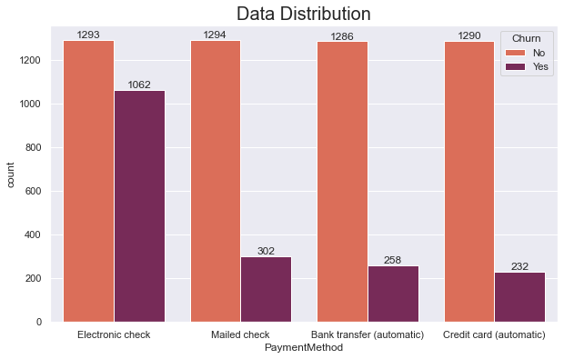

# Telco Customer Churn Prediction Using Artificial Neural Network
## Introduction
Customers are one of the important variables in a business. Businesses will not run without customers who are the target market and are definitely the main source of income for a business in all sectors. Churn and customer retention are two important factors in customer monitoring. In general, churn can be interpreted as a condition in which one or more customers leave a product or service from a business within a certain time. While retention has the opposite meaning, where one or more customers stay to use a product or service from a particular business. Monitoring of these two factors related to customers is very important, especially to maintain the company's income so that it is stable and even increases. There are many factors or variables that can influence a customer to leave a product or service from a business. These factors can be analyzed to determine what factors have the greatest influence so that prevention and service improvements can then be carried out in order to prevent customer churn from multiplying.

Telco Company is a company in California, the USA which is engaged in Home Phone and Internet Services. Telco Co. recorded to date has a total of 7043 customers. Based on the total number of existing customers, of course, there are customers who are retention and customers who churn. Several other data were also included to analyze their influence. In general, the variables contained in the data of Telco Co. customer data are customer churn, information services, such as phone, multiple lines, online security, online backup, device protection, tech support, streaming TV and movies, etc and demographic information, such as gender, and if they have partners and dependents, etc.
## Objective
Comparing Artificial Neural Network (ANN) models using sequential APIs and functional APIs to predict customer churn that occurs within a certain time becomes the main objective to be carried out. The deployment will also be carried out using the best-generated model.
## Exploratory Analysis
1. Cancellation Events

Customer churn is data that will later be used as a prediction target in the modeling that will be carried out. 26.4% of the total 7021 customers are churn customers. While 73.6% are retention customers. Based on this visualization, it can be ascertained that the target data is not evenly distributed. This is very common. The main focus of this analysis is to determine the main variables that have a high impact on customer churn so that it can be used as a basis for taking policies and prevention to minimize the amount or percentage.
2. Categorical Features Analysis

Based on gender, male customers and female customers have an equal percentage. It can be seen that churn customers in both genders are in the range of 35% of the total number of customers in each gender category. Meanwhile, if we look at the senior citizen data, which shows whether the customer is a customer over the age of 65 or not. It can be seen that the majority of customers are under 65 years old (84%). Phone and Internet Services usually target users with middle to upper income with productive age. Thus, it is natural that users under the age of 65 dominate. This also means that the market focus should be more targeted at this category. Then when viewed based on the partner category, here it is seen that a person's marital status does not have a significant effect on their tendency to use the products or services of this business. However, it can be seen that customers who are single or have no partners tend to have a higher churn percentage (8% higher) than married customers. This means that customers who already have a partner or are married usually tend to seek stability in life, so the possibility of switching services as long as there are no problems, which is significantly smaller than customers who are still single. Similar to the partner category, independent customers are much more likely to become churn customers than dependent customers. In addition, customers with paperless billing have a higher churn tendency than customers with paper billing.

Based on the services received by its customers, there are far more customers with phone service than customers who do not use phone services. So it is quite biased when compared to the two classes directly. However, in general, the two classes have almost the same churn potential when viewed from the percentage in each class. Based on the duration of the contract, it can be seen here that the longer the contract duration between Telco Co. with the customer, the less likely churn will occur. This is evidenced by the very high churn in the customer class with a month-to-month contract duration when compared to other types of contracts with a duration of one or two years at a time. However, for TV and Movie streaming services, it can be seen that the presence or absence of these services in the contract taken by the customer does not have a significant effect on the percentage of churn that occurs. This is inversely proportional to the existence of technical support, online backup, online security, and device protection. Customers who do not receive technical support, online backup, online security, and device protection tend to have a much higher churn percentage than customers who receive these services. This means that these four services are quite influential and must be improved to attract more customer retention.

Internet service is certainly one of the mainstay products where the more users, the more benefits the company will get. Based on the internet service, there are two types of services, namely DSL and fiber optic. Meanwhile, users without internet service will be ignored here. Although customers without internet service have a small churn, it is not true that the solution taken is to not offer internet service products. Thus, the focus of the analysis here lies in the other two categories. Users with this type of fiber optic internet service have a much higher churn tendency than users with DSL internet service. So, as much as possible make a marketing strategy to persuade customers without internet service and customers with fiber optic internet service to use DSL. This is inversely proportional to the category of multiple lines. The number of phone services did not have a significant effect on the churn percentage of customers directly. Based on the payment method, customers who pay by electronic check have a much higher churn percentage compared to customers who make payments by the other three methods (mailed check, bank transfer, and credit card).
2. Numerical Feature Analysis

Based on the visualization above, customers with TV and movie streaming services have higher total charges compared to customers who do not take the service package. This means that the more customers who use TV and Movie streaming services, the higher the company's revenue will be.

Customers with phone service and internet service, in general, will definitely have higher expenses or bills. However, if we look at the internet service category, it was previously explained that customers with DSL internet service have a lower churn tendency compared to fiber optic. Apparently, fiber optic users have a much higher monthly bill than DSL users. This may be one of the main causes, of the loss of customers using fiber optics. This fact reinforces the company's need to take a stronger marketing approach to attract customers to use DSL instead of fiber optic.

Based on the previous analysis, it is known that technical support, online backup, online security, and device protection services are crucial services that affect the potential for customer churn. It turns out, based on the visualization above, customers who receive these services have a high tenure tendency. That is, they are customers who use Telco Co's products or services for a longer time than other customers. This can indicate a marketing loophole. Attractive offers related to these four services can be used as weapons to attract new customers or customers who do not yet have loyalty to trust Telco Co. and minimize the occurrence of more customer churn.
## Model Summary and Conclusion

Functional and sequential ANN models were built to predict churn that occurred at Telco Co. customers. Accuracy, ROC-AUC, and Recall label 1 are used as a reference to see the performance of the model made. Accuracy and ROC-AUC show the overall model performance, while recall label 1 shows the model's ability to identify churn customers. This means that in the confusion matrix table, the model must anticipate as little as possible the identification error in the churn category or that means minimizing the number of false negatives that occur. Then, improvements were also made to both types of models by changing the number of neurons and the type of activation used. In general, the results of the improvement model show better performance than the default model. However, based on accuracy and ROC-AUC, the ANN functional model that has undergone improvement has the best results compared to the others. The following is a summary of the model's performance.